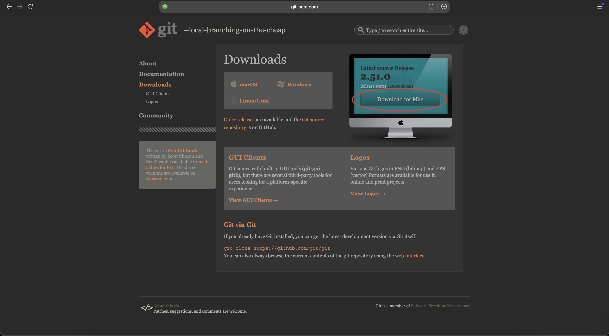
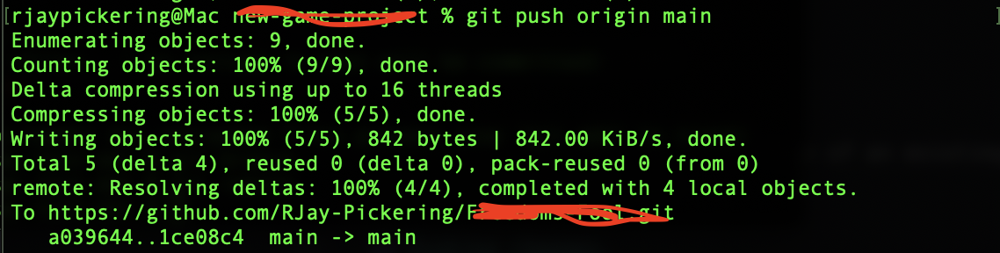

# Short quick tip to Git and GitHub
In this quick lesson, I will show you how to somewhat use Git and GitHub. We will download Git, clone a repository, initialize Git, add branches, connect Git and Github, and Push information to Github. If you have any issues with the steps, please contact me asap.

## Download Git
If you don't already have Git installed, go to the [Git Downloads](https://git-scm.com/downloads) page. On this page, click the download button as shown in the screenshot below.



From there, you can follow the steps to download it.

## Open the Terminal/Powershell
Open your terminal or powershell to do the next steps. If the terminal was open when installing Git, close it and reopen it.

## Check if Git was downloaded
To check if Git was successfully installed on your Mac or Windows, type this command:

```
git -v
```

If it is installed correctly, you should see something similar as to this:

```
git version 2.45.0
```

## Clone the repository
To clone the repo, run:

```
git clone repo-link
```

Replace repo-link with the link of the repository. Once you cloned it, open the folder in your terminal and continue from there.

*NOTE*: It may ask you to login, please do so if prompted to.

## Create your branch
Since were just starting out on this repo, we will need to create our own branch for our own changes. You do not have to do this anymore in your project after this step, unless you need more branches. To add your new branch, run:

```
git checkout -b your-branch-name
```

Replace `your-branch-name` with your name, or preferred name for now. This will both create the branch and switch to the branch. If you ever decide to switch branches, run:

```
git checkout branch-name
```

Replace `branch-name` with the name of an existing branch you want to go to.

## Change temporary-file.txt
Once you pulled the changes, update `temporary-file.txt` with new information.

## Add changes
Now, we are going to update the main branch on GitHub with our new changes. Back to the terminal, you will run:

```
git add temporary-file.txt
```

to add just that one file, or

```
git add .
```

to add all files in the folder.

## Commit changes
Before sending changes to the repository we need to commit our changes, basically sending a message about what we did in our recent change. It is important to write about what changes were made! To commit, run:

```
git commit -m "Your message here"
```

## Push changes
Now that you are in your *new* branch, we can now push the changes to GitHub. To do this, you need to run:

```
git push origin your-branch-name
```

It should look something like this:



To check if your changes went through, go to the GitHub page and refresh the page. Click branch and you should see your name.

## Final words
If you are struggling, please let me know. Im always here to help.